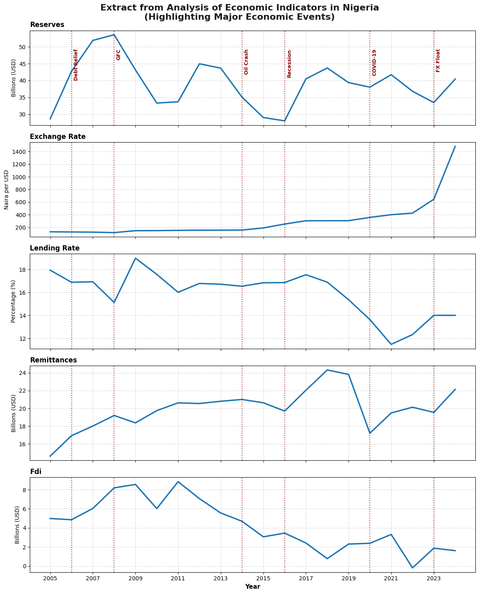
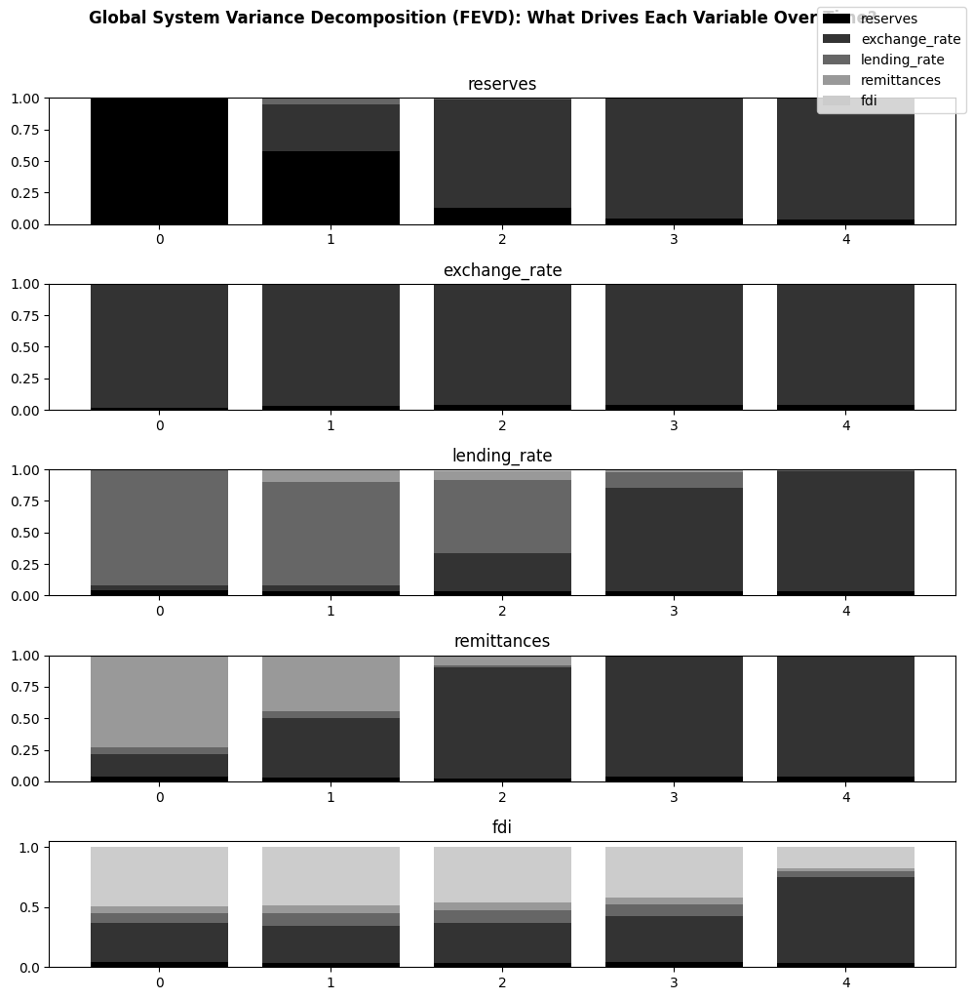
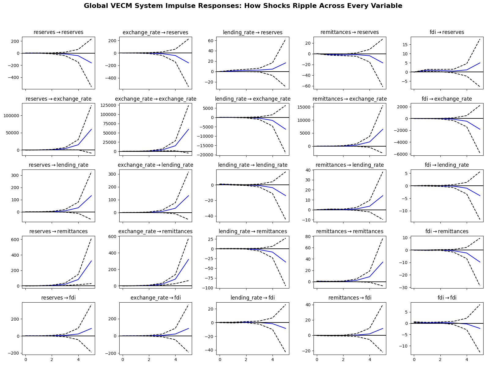

# Determinants and Dynamics of Nigeria's External Reserves (2005–2024)


A Cointegration and Vector Error Correction Model (VECM) analysis of how the exchange rate, lending rate, remittances, and FDI relate to Nigeria's external reserves — including a structural break test for the June 2023 FX float.

## Overview

Nigeria's external reserves are a critical buffer against balance-of-payments shocks and a key input into currency stability. This project asks a focused question: **how do the exchange rate, bank lending rate, personal remittances, and FDI inflows shape the level and short-run movement of reserves — and did the 2023 FX unification change those relationships?**

<p align="center">
  
</p>

Using 20 years of annual World Bank data, the analysis:
- Tests all five series for unit roots (ADF, KPSS)
- Applies the Johansen trace test for cointegration (finds **3 cointegrating relationships**)
- Estimates a VECM to capture long-run equilibrium adjustment and short-run dynamics
- Adds an exogenous 2023 FX-float dummy to test for a structural break
- Computes impulse response functions (IRF) and forecast error variance decomposition (FEVD)

## Key Findings

- Reserves close **~96% of a long-run disequilibrium within a year** — fast, active adjustment, not drift
- A weaker naira in year *t-1* is followed by a **reserve drawdown**, consistent with FX-market intervention
- The 2023 float produced a **statistically significant structural break** in 4 of 5 system equations
- The exchange rate explains **95.7% of the 5-year-ahead forecast error variance** in reserves — a striking concentration of shock exposure
- FDI is the outlier: more driven by its own shocks (17.8%) than by the exchange rate, and its post-float trajectory is ambiguous

<p align="center">
  
</p>
<p align="center"><em>The exchange rate explains 95%+ of the forecast-error variance in reserves, the lending rate, and remittances alike.</em></p>

Full results, tables, and discussion are in [`report/economic_analysis_reserve_Report.docx`](report/Nigeria_Reserves_Econometric_Report.docx) and the summary deck in [`report/economic_analysis_reserve.pptx`](report/Nigeria_Reserves_Econometric_Analysis.pptx).

<details>
<summary><strong>See the impulse response functions (click to expand)</strong></summary>
<br>
<p align="center">
  
</p>
</details>

## Data

| Variable | Description | Unit | Source (WDI code) |
|---|---|---|---|
| `reserves` | Total reserves, including gold | US$ billions | `FI.RES.TOTL.CD` |
| `exchange_rate` | Official exchange rate (period average) | ₦ per US$ | `PA.NUS.FCRF` |
| `lending_rate` | Bank lending interest rate | % per annum | `FR.INR.LEND` |
| `remittances` | Personal remittances received | US$ billions | `BX.TRF.PWKR.CD.DT` |
| `fdi` | Net FDI inflows | US$ billions | `BX.KLT.DINV.CD.WD` |

Source: [World Bank World Development Indicators](https://databank.worldbank.org/source/world-development-indicators), Nigeria, 2005–2024, retrieved via `pandas_datareader`.

## Methodology

1. Data sourcing & cleaning (WDI panel, interpolation for gaps)
2. Exploratory data analysis (trends, distributions, descriptive statistics)
3. Unit root testing (ADF & KPSS, 3 trend specifications)
4. Johansen cointegration test
5. VECM estimation (short-run dynamics + error-correction speed)
6. Structural break test (2023 FX-float dummy)
7. Impulse response functions & forecast error variance decomposition

## Repository Structure

```
.
├── notebook/
│   └── economic_analysis_reserves.ipynb        # Full analysis, start to finish
├── report/
│   ├── economic_analysis_reserves.docx
│   └── economic_analysis_reserve.pptx
├── figures/                           # Exported charts used in the report/deck
│   ├── raw_series_charts_2.png
│   ├── fevd_charts_3.png
│   └── irf_charts_2.png
├── requirements.txt
└── README.md
```

## Running the Analysis

```bash
git clone https://github.com/<RidwanOkeshola>/nigeria-reserves-vecm.git
cd nigeria-reserves-vecm
pip install -r requirements.txt
jupyter notebook notebook/economic_analysis_reserves.ipynb
```

## Limitations

Twenty annual observations is a small sample for a five-variable VECM/VAR system — coefficient and variance-decomposition estimates carry meaningful uncertainty. See the full report for a complete discussion of limitations, including unit root test ambiguity, interpolated data points, and the reduced-form (associational, not causal) nature of the model.

## Author

**Ridwan Okeshola** — Financial/ Economic Analyst

Feedback and questions welcome — feel free to open an issue or connect on [www.linked.com/in/ridwanokeshola](#).

## License

This project is shared for educational and portfolio purposes. Data is sourced from the World Bank under its [open data terms](https://data.worldbank.org/summary-terms-of-use).
